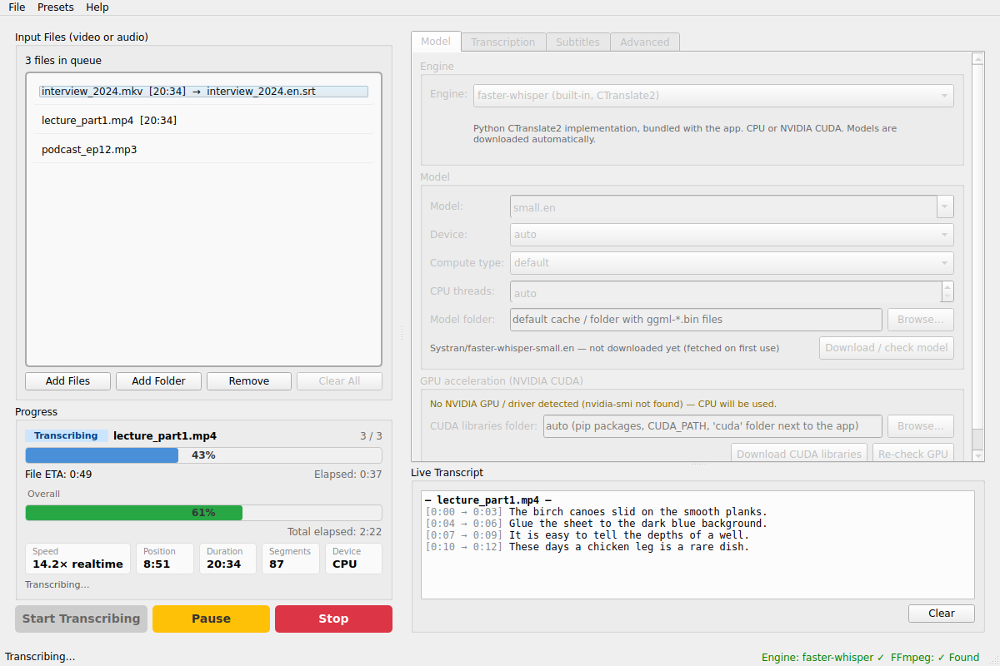
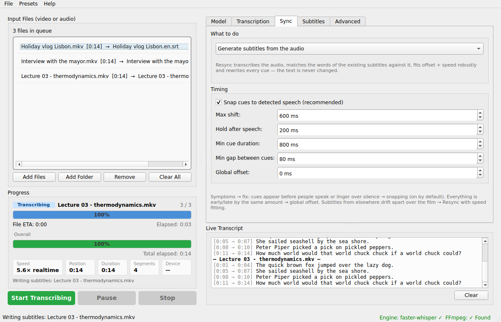

# whisperer

Batch **subtitle generator** GUI for video and audio files, powered by OpenAI Whisper models.
Drop files in, pick a model, press *Start* — `.srt` / `.vtt` / `.ass` / `.sub` / `.txt` / `.json` subtitles are
written next to your videos, or put into the video itself: as a soft track a player can switch off, or burned
into the picture.
A sibling of [videer](https://github.com/hclivess/videer) (same queue / progress / presets workflow) built for speech-to-text.



## Features

- **Two engines**
  - [faster-whisper](https://github.com/SYSTRAN/faster-whisper) (CTranslate2) — built in, CPU or NVIDIA CUDA,
    models download automatically on first use, built-in VAD silence filter, word timestamps
  - [whisper.cpp](https://github.com/ggerganov/whisper.cpp) — drives an external `whisper-cli` binary
    (CPU / CUDA / Vulkan / Metal builds), GGML models
- All model sizes: `tiny` … `large-v3`, `large-v3-turbo`, `distil-large-v3`, English-only `*.en` variants,
    plus language fine-tunes from Hugging Face in the same dropdown (editable `models.json`)
- English by default; ~30 languages or auto-detect; *translate to English* task
- Live queue: add files / folders or drag & drop while a run is in progress, reorder by dragging, pause / resume / stop
- Live transcript panel — segments appear as they are decoded
- Progress panel: per-file and overall bars, ETA, speed (× realtime), position, segment count
- **Multi-pass verification against hallucinations** (3 passes by default) — the file is decoded more than
  once and only what the decodes agree on is kept; text with no audio under it (*"Thank you for watching"*,
  repetition loops) is dropped on the evidence of the other passes and the VAD, and speech the first pass
  skipped is recovered. Passes 3+ only re-decode the spans nothing agreed on
- **Timing that follows the audio** — cues are snapped to speech on/offsets found by a voice-activity detector
  (Silero VAD), held a moment after speech, never overlapping; word-level alignment is used to build the cues
- **Resync existing subtitles** (the SubSync idea, built in): match an `.srt` / `.vtt` / `.ass` / `.sub` against a
  transcript of the audio, fit offset + speed robustly, rewrite the timing — the text stays untouched
- Subtitle layout control: max characters per line, max lines per cue, max cue duration — long segments are re-split
  on word timestamps and lines are balanced (no orphan words)
- Output next to the source or into a custom folder, `video.en.srt` naming that media players auto-detect, suffix, overwrite guard
- One **Deliver as** dropdown decides what comes out: subtitle files, a video with a soft subtitle track
  (`.mkv` / `.mp4`, stream copy, no re-encode), or a video with the subtitles **hardcoded** into the picture
- Subtitle formats: `srt` (default), `vtt`, `ass`, `sub` (MicroDVD), `txt`, `json`
- Presets menu (Fast / Balanced / Accurate / Best), save / load / import / export your own, user defaults
- Settings sanity check before starting (English-only model + foreign language, translate with `*.en`, missing binaries …)
- Cross-platform: Windows, Linux, macOS

## Requirements

- Python 3.9+ and `pip install -r requirements.txt` (PySide6, faster-whisper, psutil) — or grab a prebuilt binary from the
  [latest release](https://github.com/hclivess/whisperer/releases/latest) (no Python needed)
- [FFmpeg](https://ffmpeg.org/) in PATH or next to the app — used to extract audio (16 kHz mono WAV), read durations
  and embed subtitles. faster-whisper can decode most files by itself, but FFmpeg is strongly recommended and required for whisper.cpp.
- Optional: NVIDIA GPU — see [GPU acceleration](#gpu-acceleration-nvidia) below.
- Optional: `whisper-cli` from whisper.cpp plus GGML models (`ggml-small.en.bin` …) from
  [huggingface.co/ggerganov/whisper.cpp](https://huggingface.co/ggerganov/whisper.cpp/tree/main)

## Run

```
pip install -r requirements.txt
python main.py
```

Windows: double-click `run.cmd`. Linux/macOS: `./run.sh`.

## GPU acceleration (NVIDIA)

faster-whisper runs on CUDA 12 and needs the **cuBLAS 12** and **cuDNN 9** runtime libraries. whisperer finds them
automatically and loads them itself — no `PATH` / `LD_LIBRARY_PATH` editing:

| You run… | Do this |
|---|---|
| from source | `pip install -r requirements-cuda.txt` (adds `nvidia-cublas-cu12`, `nvidia-cudnn-cu12`, ~1 GB) |
| the prebuilt binary (any OS) | **Model tab → Download CUDA libraries** — fetches cuBLAS 12, cuDNN 9 and NVRTC from PyPI's official NVIDIA wheels (~1 GB, resumable) into a `cuda` folder next to the app. Done once. |
| the prebuilt binary (Windows, manual) | drop `cublas64_12.dll`, `cublasLt64_12.dll`, `cudnn64_9.dll` (+ their `cudnn_*64_9.dll` companions) into a `cuda` folder next to `whisperer.exe`, or point **Model → CUDA libraries folder** at wherever they live (e.g. `C:\Program Files\NVIDIA\CUDNN\v9.x\bin`, a CUDA Toolkit `bin` folder, or the `nvidia\cublas\bin` + `nvidia\cudnn\bin` folders of the pip wheels). Ready-made bundle: [Purfview's cuBLAS+cuDNN zip](https://github.com/Purfview/whisper-standalone-win/releases/tag/libs) |
| the prebuilt binary (Linux) | `pip install nvidia-cublas-cu12 nvidia-cudnn-cu12` into any Python, or copy `libcublas.so.12`, `libcublasLt.so.12`, `libcudnn*.so.9` into a `cuda` folder next to the binary |

The **Model** tab shows what whisperer sees: GPU name / driver (from `nvidia-smi`), which libraries were found and whether
CTranslate2 can use the device, with a *Re-check GPU* button. Leave *Device* on `auto` (CUDA when usable, CPU otherwise) and
*Compute type* on `default` (`float16` on GPU, `int8` on CPU). Expect roughly 10–30× realtime with `large-v3-turbo` on a
mid-range card versus ~1–3× on a CPU with `small.en`.

whisper.cpp uses the GPU according to how the binary was built (CUDA / Vulkan / Metal); Device = `cpu` passes `-ng`.
macOS has no CUDA — use whisper.cpp's Metal build there, or faster-whisper on the CPU.

## Which model?

| Model | Size | Notes |
|---|---|---|
| `base.en` | 145 MB | very fast, fine for clear speech |
| `small.en` | 480 MB | **default** — good balance on CPU |
| `medium.en` | 1.5 GB | noticeably better on accents / noise |
| `large-v3-turbo` | 1.6 GB | best speed/quality on a GPU |
| `large-v3` | 3 GB | highest accuracy |

Pick the model in the **Model** tab. *Download / check model* fetches it up front; the label next to it shows
whether the model is already cached.

### Fine-tuned models

Whisper is multilingual but generic, and a model fine-tuned on one language usually beats it on that language.
faster-whisper loads any CTranslate2 Whisper model from the Hugging Face Hub, so the dropdown lists a few below
the sizes — picking one also selects the language it was trained for:

| Model | Language |
|---|---|
| `kiendt/PhoWhisper-large-ct2` | Vietnamese (VinAI's PhoWhisper) |
| `distil-whisper/distil-large-v3.5-ct2` | English, faster than `large-v3` |
| `avazir/faster-distil-whisper-large-v3-ru` | Russian |
| `jimmymeister/whisper-large-v3-turbo-german-ct2` | German |
| `kotoba-tech/kotoba-whisper-v2.0-faster` | Japanese |
| `ivrit-ai/whisper-large-v3-turbo-ct2` | Hebrew |
| `techiaith/whisper-large-ft-cy-en-ct2` | Welsh / English |
| `SoybeanMilk/faster-whisper-Breeze-ASR-25` | Mandarin, incl. Mandarin/English code-switching |

The list is not fixed: it lives in **`models.json` next to the app**, written on first run, and the dropdown is
still editable, so any other repo id (`owner/name`) or a local folder holding `model.bin` can simply be typed in.

```json
{
  "models": [
    {"id": "kiendt/PhoWhisper-large-ct2", "label": "PhoWhisper large — Vietnamese", "language": "vi"},
    {"id": "/models/my-own-ct2-model", "label": "My own fine-tune", "language": "cs"}
  ]
}
```

`label` is what the tooltip shows and `language` is optional. The model must be **CTranslate2-converted** — a plain
PyTorch Whisper checkpoint has to go through `ct2-transformers-converter` first. Repos that ship no `tokenizer.json`
(PhoWhisper is one) fall back to the standard Whisper tokenizer, which is what they were trained with anyway.

Tips: keep **VAD filter** on (skips silence and prevents hallucinated text in quiet parts), use an
**initial prompt** to teach the model names and jargon, and turn on **word timestamps** for tighter cue splitting.

## Sync



Whisper's own timestamps are decoder guesses quantised to 20 ms; at segment edges they routinely start early and
linger over silence, and a few containers make things worse by storing an audio stream that starts later than the
video. whisperer 1.3 fixes the timing from the audio itself:

| Problem | What whisperer does |
|---|---|
| Cue appears before the line is spoken / stays on after it | **Snap cues to detected speech** (Sync tab, on by default): every cue start/end is moved onto the nearest speech onset/offset within *Max shift* (600 ms), cues that run over silence are cut, then *Hold after speech* (200 ms), *Min cue duration* and *Min gap* are applied. Word timestamps are used automatically. |
| A sentence is cut in half and a new one starts mid-phrase | **Remove full stops the speaker never made** (Subtitles tab, on by default): Whisper punctuates by language model, not by ear, and regularly ends a sentence inside a phrase — *"When someone is. First about to embark on a minor task"*. People pause between sentences, so a full stop with less than *Shortest pause between sentences* (250 ms) of silence around it is the model's invention: it is removed and the next word goes back to lower case. Names (seen capitalised mid-sentence elsewhere) and *I* keep their capital; abbreviations, initials, decimals and `...` are never touched. Without word timestamps almost nothing is repaired — only `a.` / `an.` / `the.`, which cannot end an English sentence under any reading. |
| A cue flashes on screen for a fraction of a second | **Merge cues that stay too short into their neighbour** (Sync tab, on by default): Whisper emits segments as short as 10 ms, and a cue squeezed against the next one cannot reach *Min cue duration* on its own. Such a cue is first stretched into the free time after it and, if there is none, glued to the cue beside it — two short lines shown together read fine, a line held over the next one's speech does not. The cue layout is a preference here, not a veto: when the joined text does not fit *Max lines*, the cues are merged anyway and the text takes an extra line (lines never go over *Max line length*) — the merged cue spans exactly the two it replaces, so no boundary moves and nothing loses sync. This runs in every mode, **resync included**. Merging is only refused when the result would run past *Max cue duration* or the two cues are over 1.5 s apart; such a cue borrows the missing time from a neighbour that has it to spare, so it still reaches *Min cue duration*. |
| Whole paragraphs nobody said (*"Thank you for watching"*, a line repeated forty times) | **Passes** (Transcription tab, 3 by default): the file is decoded more than once — each pass with no context carried over (a repetition loop cannot feed itself twice), a different beam, then sampling temperature, and the names the first pass settled on handed back as the prompt. A hallucination is text with no audio under it, so the text alone can never prove it: **agreement decides**, because invented text is often fluent and scores well but two decodes rarely invent the *same* words. Text two passes agree on is kept, a cue no other pass heard anything under **and** the VAD finds no speech in is dropped, and speech the first pass skipped but a later pass and the VAD both found is recovered. Only when no two passes agree does Whisper's own confidence (`avg_logprob`, `no_speech_prob`, compression ratio, and how much speech is really in the span) pick the winner — and that cue is reported as unresolved rather than quietly trusted. Passes 3+ re-decode only the unresolved spans, snapped out to Whisper's 30 s encoder window, so they cost a fraction of a full pass. Timing is always the first pass's and no words are ever rewritten. Set *Passes* to 1 for a single decode. |
| A capital in the middle of a phrase (*"we drove to A quiet village"*), or a sentence that never gets its full stop | **Settle capitals with no full stop in front of them** (Subtitles tab, on by default): Whisper decodes in 30-second windows and starts each one as if it were a fresh utterance. The word timestamps say which of the two things happened — a real silence before the capital (after a word a sentence can end on) means the speaker did stop and the full stop is added; **anything else lowers the capital**, because a capital with nothing in front of it is an error either way and a pause too short to prove a sentence break does not make it less of one. A capital with **another capital beside it** is never touched: those are titles and names — *a chapter called The Long Way Home*, *Blue Harbour* — and they are not this repair's business. Adding is held to the higher standard, because Whisper cuts its windows *at* silences: no full stop is invented after a word a sentence does not plausibly end on (*to*, *the*, *and*) or over punctuation already there. A word the transcript never writes in lower case may be a name and keeps its capital either way. Without word timestamps nothing is measured and nothing is changed. |
| A word decoded as the commoner word it half sounds like (*"harvest fair"* → *"harbour fare"*) | **Hotwords** (Transcription tab): terms to weight the decoder towards, comma separated. No amount of re-decoding fixes this one — every pass hears the same audio the same way, so all of them agree on the wrong word and verification confirms it. Naming the words is the only thing that prevents it. Unlike the *Initial prompt* these are not text the model may echo or imitate, and the names the first pass settled on are added to them automatically for the later passes (faster-whisper only). To find the ones that slipped through, switch on **Write a review list** (Subtitles tab, off by default): it writes `<name>.review.txt` next to the subtitles with every span the passes disagreed on — including the ones they agreed on but *worded* differently, which is where a meaning-changing mis-hearing hides — plus the cues the decoder was least sure of. Nothing is rewritten; a mis-hearing every pass agrees on can only be found by reading. |
| A sentence written twice, the second copy running over the words that follow it | **Remove a sentence the model wrote twice** (Subtitles tab, on by default): after a window boundary Whisper sometimes re-emits the sentence it has just written and then carries on, so the copy sits on top of the speech that was really there. Only the repeated run is removed — the cue keeps its real continuation and starts where its own words start. **A speaker repeating himself is not this**: saying a phrase twice takes roughly the same time both times, while a re-emission is squeezed into whatever room is left beside the real words, so the copy is compared with the original by the clock and only removed when it runs at under 60 % of it. Short repetitions are never touched at all. |
| The same name written both ways (*Halloran* in one cue, *halloran* in the next), or a lower-case *i* | **Give a name the case the rest of the file gives it** (Subtitles tab, on by default): Whisper is not consistent about names across its windows, and nothing in the audio decides which spelling is right — the rest of the file does. A word capitalised in most of its mid-sentence sightings is capitalised in the others too. A word the file mostly writes in lower case is left alone, which keeps ordinary words that happen to start a sentence somewhere (*will*, *mark*, *rose*) out of it; a name must be seen capitalised at least twice to count, **unless one of those sightings is a possessive** — *somebody's* is somebody, and a name mentioned only twice in an hour is otherwise left half-corrected; words that open an utterance (*okay*, *right*, *well*) are never treated as names however often they get capitalised; and a Title-Cased stretch is ignored entirely, so one *"And So The Next Morning"* cannot license capitalising *rebuke* everywhere. In English the pronoun *I* is restored as well. |
| A phrase repeated over and over, faster than anyone could say it | **Remove text the model repeated** (Subtitles tab, on by default): Whisper sometimes latches onto a few words and repeats them until the window ends. The words are real and there is speech underneath, so neither the VAD nor another pass helps — every decode hears the same thing and agrees. What gives it away is arithmetic: the cue claims more words than a mouth can produce in its span. The repeated block is folded down to one copy, but only when the cue is impossible to begin with **and** folding brings it back to a rate a person could speak at. A cue that stays impossible is left exactly as it is and named in the log — something else is wrong with it, and nothing here knows what. Repetition at a human rate is the speaker repeating himself and is never touched. |
| Everything early by a constant amount | Audio streams with a non-zero start time are now extracted in place (`aresample=first_pts=0`), and timestamp gaps are filled with silence so nothing drifts over dropped packets. If you still want a nudge: **Global offset**. |
| Subtitles from somewhere else are off or drift over the film | **Resync an existing subtitle file**: whisperer transcribes the audio, matches the words of your `.srt`/`.vtt` against it, fits `audio_time = speed × sub_time + offset` with a robust (median-slope + inlier least-squares) fit, applies it to every cue and VAD-snaps the result. Speed is only fitted on clips longer than two minutes and only in the 0.9–1.1 range (23.976 ↔ 25 fps conversions). Output: `movie.synced.srt`; the log shows offset, speed, drift per hour and how many words agreed. |

Resync reads **SRT, WebVTT, ASS/SSA and MicroDVD**, recognised by content rather than by extension, so a
mislabelled file still opens. An ASS or MicroDVD file keeps its own styling — only its timings are rewritten. MicroDVD counts frames: the rate it declares on its first line wins, the video's
own rate is used when it declares none, and 25 stands in when neither is available — a wrong rate is a constant
ratio error, which is exactly what the speed fit corrects.

**A styled file keeps its styling.** With *Keep an ASS/MicroDVD file's own styling and layout* on (Sync tab,
the default), the file you gave it comes back with only its timestamps changed — `movie.synced.ass`, byte for
byte identical everywhere else: styles, `\pos`, `\fad`, karaoke, comments, script headers. Its cue layout is
its own, so the pass that joins cues too short to read is not run on it: that pass changes the cue count, and
a changed count leaves no honest mapping back to the original's lines. If something else changes the count
anyway, the log says so and the ticked formats carry the new timings instead. Turn the setting off to
regenerate the file in the ticked formats, which loses the styling.

Resync picks `movie.srt` / `movie.vtt` / `movie.ass` / `movie.sub` next to the video unless you choose a file. A file that does not match the
audio (wrong language, different cut) is rejected with an explanation rather than guessed at.

## Measured on real film

Three openly licensed films (CC-BY, Blender Foundation), three-minute excerpts, run through the app end to
end with the ordinary defaults — three passes, snapping, and every repair on. Nothing was tuned for them.

| | Tears of Steel | Elephants Dream | Sintel |
|---|---|---|---|
| container / codec | MOV, H.264 + AAC | Ogg, Theora + Vorbis | Ogg, Theora + Vorbis |
| model | `base.en`, then `large-v3` | `large-v3` | `large-v3` |
| cues below *Min cue duration* | 0 | 0 | 0 |
| lines over *Max line length* | 0 | 0 | 0 |
| gaps below *Min gap* | 0 | 0 | 0 |
| capitals with no full stop before them | 1 / 0 | 2, both correct (a name, and a word standing before it) | 0 |
| text invented over non-speech | none | none | none |

**Against the official subtitles.** Tears of Steel ships an English subtitle file, so the regenerated cues
can be scored against it. Words matching the official text rose from **59.6 % with `base.en` to 67.0 % with
`large-v3`** on identical audio; of the 23 official cues in that stretch, 12 came back almost entirely, 8
partially and 3 not at all — and all three of the misses sit where score and effects bury the dialogue.
Timing landed within **0.27 s** of the official cues (`large-v3`), our cues sitting a fraction later because
subtitles are conventionally timed a beat early while snapping puts them on the speech onset.

**Where nothing was said.** Sintel's excerpt is 183 seconds holding only 26 seconds of dialogue — the rest
is score and action. Nothing was invented over any of it, which is the case the multi-pass verification
exists for and the VAD filter usually prevents from arising at all.

This is a snapshot on short excerpts rather than a benchmark: it says the pipeline's guarantees hold on real
material and real containers, not how well Whisper transcribes any particular film.

## Output

For `movie.mp4` with language English you get `movie.en.srt` (and any other format ticked on the Subtitles tab).

**Deliver as** (Subtitles tab) decides whether a video is written as well:

| Choice | What you get | Cost |
|---|---|---|
| **Subtitle file** (default) | the ticked formats only | none |
| **Embed in the video** | `movie.subbed.mkv` / `.mp4` — the original streams plus a subtitle track the player can switch on and off | a stream copy: quick, no quality lost |
| **Hardcode into the video** | `movie.hardsub.mkv` / `.mp4` — the subtitles drawn into the picture, impossible to turn off | a full re-encode (x264, quality selectable): roughly as long as the film, and some quality goes |

Hardcode is for players and sites that show no subtitle tracks at all; anywhere else, embedding keeps the
picture untouched and stays switchable. An audio file has no picture to burn into, so hardcoding skips it and
says so — the subtitle files are still written.

Formats: `srt` and `vtt` are the ones players expect, `ass` carries styling and line breaks explicitly, `sub`
is MicroDVD for older players — it counts **frames**, so it is written at the source's frame rate (declared on
its first line, 25 where none could be probed) and drifts if played at another rate. `txt` is the text alone,
`json` keeps the segments, word timings and Whisper's own quality numbers.

## Windows says the app is not safe

The Windows build is not code-signed yet, so SmartScreen shows *"Windows protected your PC — unknown
publisher"* the first time you run it. Nothing is wrong with the file; an unsigned executable from a small
project simply has no reputation with Microsoft.

- **To run it:** *More info* → *Run anyway*. If the whole folder came out of a downloaded `.zip`, Windows also
  tags it with the mark-of-the-web; `Unblock-File .\whisperer\*` in PowerShell clears that.
- **To check you got what we built:** every release ships a `.sha256` next to the archive.
  `Get-FileHash whisperer-1.3.7-windows-x64.zip` must print the same digest.
- **If Defender quarantines it outright** (rather than just warning), that is a false positive on the
  PyInstaller runtime — please report it at <https://www.microsoft.com/wdsi/filesubmission> and open an issue.

The executable carries full publisher/product metadata and is built with `--onedir` (no self-extracting stub)
and without UPX, which is what antivirus heuristics react to. Code signing through
[SignPath Foundation](https://signpath.org/opensource) (free for open-source projects) is wired into the release
workflow and switches on as soon as the `SIGNPATH_API_TOKEN` secret exists.

## Building binaries

`python build.py` (needs `pip install pyinstaller`) produces a standalone PyInstaller build in `dist/`. Setting
`WHISPERER_SELFTEST=<media file>` makes the app transcribe that file headlessly with `tiny.en` and exit — the CI uses it to
verify the frozen build. Tagged pushes build Windows / Linux / macOS packages on
GitHub Actions and attach them to the release.

## Changes in 1.8.4

- **Resyncing an ASS or MicroDVD file no longer costs it its styling.** 1.8.3 could read those formats but
  regenerated the output from the cues, so an ASS came back as plain text in whisperer's default style —
  positioning, fonts, karaoke and comments gone. The original file is now rewritten in place: the two
  timestamps on each `Dialogue:` line change and nothing else does, so what comes out is byte for byte the
  file that went in, with the timing corrected.
- The mapping from cue back to line is the part that has to be right: events are matched in the order the
  parser produced them, which is by start time, so a file whose lines are out of chronological order still
  retimes correctly. A `Comment:` line is not a subtitle and keeps its own timing. MicroDVD is rewritten at
  the rate the file declares, since new frame numbers written at another rate would move every cue.
- **The cue-joining pass is skipped for a file being retimed in place**, because it changes the cue count and
  the mapping depends on that count. If anything else changes it, the retimed file is not written, the log
  says why, and the formats ticked on the Subtitles tab carry the new timings.

## Changes in 1.8.3

- **Resync reads ASS/SSA and MicroDVD too.** 1.8.2 started writing both and could not read either back, which
  left anyone who chose those formats unable to resync their own output. The format is recognised from the
  content, not the file name.
- ASS is read through its own `Format:` line rather than the usual field order, because that order is not fixed
  between files and a file that moves `Start` and `End` would otherwise be read backwards. `Comment:` lines are
  not subtitles, override blocks are styling, and `\N` / `\n` / `\h` become real breaks and spaces. A truncated
  line costs that one cue, not the file.
- MicroDVD needs a frame rate to mean anything: the file's own declaration wins, the video's probed rate stands
  in, and 25 is the last resort. Since a wrong rate is a constant ratio over the whole file, the speed fit is
  what corrects it — that is the 23.976 ↔ 25 case resync already existed for.
- **Styling was not carried over** in this version; 1.8.4 fixes that by rewriting the original file in place.
- Auto-discovery next to the video and the file dialog cover all four formats; a `.synced.` file from an earlier
  run is never picked up, whatever its extension.

## Changes in 1.8.2

- **One dropdown decides what comes out.** *Deliver as* on the Subtitles tab: a subtitle file, the subtitles
  embedded in the video as a soft track, or hardcoded into the picture. It replaces the *Embed into video*
  checkbox, and settings and presets that carry the old checkbox are read as *Embed*.
- **Hardcoding.** The subtitles are drawn into the video with FFmpeg's `subtitles` filter and x264 (CRF 18 /
  20 / 24, chosen in the box beside the dropdown), audio copied where the container allows it and re-encoded
  where it does not. The progress bar follows the encode, Stop kills it within a second, and the output is
  written under a temporary name so a stopped encode leaves no half-written film.
- FFmpeg is run from a temporary folder holding the subtitles as `subs.srt`, because the filter argument is
  parsed by FFmpeg rather than the shell: a real path's colons, backslashes, commas and brackets each break it
  in their own way, and a plain name in the working directory has none of them. Every other path is made
  absolute, or it would be resolved against that folder.
- An audio file has no picture to burn into: the subtitles are written and the video step is skipped with a
  message, rather than failing the file.
- **Two more subtitle formats.** `ass` (Advanced SubStation Alpha, styled, with the line breaks placed
  explicitly) and `sub` (MicroDVD, for older players). MicroDVD counts frames rather than seconds, so it is
  written at the source's frame rate, taken from the file and declared on the first line — 25 when nothing
  could be probed.

## Changes in 1.8.1

- **Fine-tuned models are in the dropdown now, not just typeable.** faster-whisper has always accepted any
  CTranslate2 model id, but nothing in the app said so or suggested one, so the feature existed only for people
  who already knew it existed. Eight language fine-tunes — Vietnamese, Russian, German, Japanese, Hebrew,
  Welsh, Mandarin and a faster English distil — now sit below the sizes.
- **Picking one selects its language.** A model fine-tuned for Vietnamese left decoding as English is a
  fine-tune wasted, and it fails quietly: output still appears, it is just worse than plain Whisper would have
  been. Hebrew and Welsh were added to the language list for the same reason.
- **The list is a file, not a hard-coded table.** `models.json` is written next to the app on first run and read
  at startup; edit it to add your own, and the box stays editable for a one-off repo id or a local folder.
- The catalogue is offered only under faster-whisper — whisper.cpp reads GGML files and cannot load any of it.

## Changes in 1.8.0

Found by transcribing twelve hour-long lecture recordings end to end with the ordinary defaults and
reading the results file by file; every change was validated by replaying the captured raw decodes of
every previously processed file through the changed code, plus the test suite, before moving to the next.

- **A repaired capital stays repaired.** When a false sentence break was removed, the word after it was
  lowered in the cue's text but not in its word list. The moment anything downstream rebuilt the text
  from the words - splitting does - the capital and the break came back; worse, the text/word mismatch
  marked the segment untouchable for every later word-level repair, silently switching them off for
  exactly the cues that needed them. The case change is now mirrored into the word token, under a guard
  that the token really is the word the text lowered. On one lecture this settled a third of the stray
  capitals on its own.

- **Pauses are measured against the audio, not the decoder's claims.** Both sentence repairs decide by
  the pause around a full stop or a capital, taken from the word timestamps - and in a stretch where the
  decode has come apart those timestamps lie, writing one-word sentences with half-second gaps over
  continuous speech. Every invented full stop then survived on the evidence of its own invented timing.
  When the VAD's speech regions are available the pause is now the audible silence in the gap: a claimed
  pause the VAD heard speech through counts as no pause. A lecture section that read
  *"harmonious interplay Of. Multiple. Patterns right."* comes out as prose again.

- **No pause makes "the." a sentence.** A full stop after "the" / "an" survived whenever the speaker
  genuinely paused there for emphasis, which speakers do constantly. The article veto now outranks the
  pause everywhere, not only in the no-timestamps fallback.

- **Hotwords learn names, not habits.** The vocabulary the first pass hands to the later ones accepted
  any word capitalised once in mid-sentence and seen twice - which let "The", "And", "You" through on
  ordinary decode stumbles. Fed back as hotwords they taught the later passes a style, and both
  verification passes of an hour-long file came apart into comma-separated Title Case identically; the
  1.7.6 guard kept the wreckage out of the file, but the passes bought no verification. A candidate is
  now vetoed by the transcript's own habits - a word the file mostly writes in lower case is not a name,
  and utterance openers and I-contractions never qualify - the same evidence standard the case unifier
  already applies. On the same file the learned list went from "The, And, That's, You, It's, ..." to
  "Husserl, Heidegger, Aries, Eve, Freud, Nietzsche", and the later passes stayed prose.

- **Every pass is compared on the same ground.** Candidates were compared over a padded span (the passes
  cut segments in different places), but the transcript's own cue brought only its unpadded text to that
  comparison. On short cues the handicap outweighed the wording: identical healthy passes could score as
  "worded differently", and a real one-word disagreement drowned in neighbour words every pass renders
  the same. All candidates, the base included, are now compared on the cue's territory - the same
  non-overlapping stretch used for replacement text - and the agreement bar is recalibrated for the
  symmetric measure (one word in three differing is a disagreement, one in five is the same reading).
  First lecture: cues settled by agreement rose from 1594 to 1748 of 1864, unresolved fell from 7 to 5.

- **A pass that came apart no longer floods the review list.** Its text was already barred from the
  file; it is now also left out of the "worded differently" comparison, so the review list holds real
  disagreements instead of one Title-Case line per cue.

- **The line length limit is hard again.** Balancing a cue's text over its lines widened them past *Max
  line length* whenever no word-boundary split fit the line count - a 45-character line under a
  42-character limit, on any awkward two-line cue. The text now takes another line instead, which is
  what the merge logic already promised; only a single word longer than the limit itself may ever
  exceed it.

- **A loop inside a long segment is caught.** The repetition folding of 1.7.12 gated on the cue's
  overall rate, so a one-second loop hiding in a thirty-second segment passed as human speech. The
  looped words are now also held to the impossible-rate bar by their own timestamps; a speaker's
  repetition at speaking speed stays untouched either way.

- **Speed and ETA are per pass.** Each pass starts its position over at zero, but the clock did not, so
  every pass after the first reported a fraction of its real speed.

## Changes in 1.7.12

- **A phrase the decoder repeated faster than speech is folded down to one copy.** This is the hallucination
  that survives everything else: real speech underneath, every pass hearing it the same way, agreement
  confirming it. Only the clock catches it — twenty-five words inside a second and a half is not something a
  mouth does. Two conditions are both required, and the loop's period is taken as the *shortest* repeating
  block, since five words repeated four times also matches ten words repeated twice and folding the ten
  would leave half the loop standing.
- **A cue that is still impossible after folding is left alone and named in the log.** No repeated block
  means something else is wrong with it — most often a cue squeezed into too short a span — and this pass
  does not know what, so it does not guess.
- Measured over four hour-long transcripts: six loops folded (87 words in total), and every repetition at a
  human rate — 2 to 7 words a second — untouched.

## Changes in 1.7.11

- **The icon file had no small sizes.** `icon.ico` held a single 256×256 uncompressed bitmap, and the
  Windows taskbar draws at 16, 24 and 32 pixels — with nothing it could use, the shell fell back to its
  generic application icon. The file now carries 16, 20, 24, 32, 40, 48, 64 and 128 pixel images as
  bitmaps, with the 256 kept PNG-compressed, which is the layout Windows has always accepted. It is also
  smaller than before.
- Together with the Application User Model ID added in 1.7.10, the taskbar now has both halves of what it
  needs: an identity of its own, and an icon it can actually draw at the size it wants.

## Changes in 1.7.10

- **The Windows taskbar shows the app's own icon.** The taskbar button takes its icon from the process's
  Application User Model ID rather than from the window, and with none of its own the process was grouped
  under whatever launched it and wore that program's icon. One is now set before any window exists, and it
  carries no version number so a pinned button survives an upgrade.
- The icon is also found reliably wherever it ends up — beside the frozen executable, inside a one-file
  bundle, or in the source tree — instead of only where deriving the path from `__file__` happened to look.

## Changes in 1.7.9

- **A possessive counts as proof of a name.** A name mentioned only twice in a long recording, with one of
  those at a cue start where a capital proves nothing, fell below the two-sighting bar and came out
  capitalised in one place and lower case in another. One sighting is now enough when it is a possessive,
  because *somebody's* is somebody. Measured over four hour-long transcripts, exactly two words qualified
  this way and both were people.
- **Words that open an utterance are never names.** *okay*, *right*, *well* and their like collect capitals
  mid-phrase constantly, which was enough to make the pass capitalise them everywhere else. Excluding them
  outright removed every false name in those same four transcripts.
- Relaxing the two-sighting rule in general was tried first and rejected on the same material: it fixed one
  name and wrongly capitalised three ordinary words.

## Changes in 1.7.8

- A file given by a bare name, with no directory part, no longer fails with an unexplained
  `FileNotFoundError: ''` — the output folder is resolved from the absolute path of the source. The file
  dialog and drag-and-drop always give absolute paths, so this only ever bit callers that did not.

## Changes in 1.7.7

- **The Live Transcript now shows what was written.** It filled from the first decode and was never touched
  again — before the other passes had had their say, before the repairs, the splitting, the snapping and
  the merging — so what it showed was not what ended up in the file, and a first pass that came apart
  looked alarming there long after the written subtitles were fine. When a file is finished its block in
  the pane is replaced with the cues actually written, and marked *(written)*.
- **The view follows the work.** The cursor moves to the newest line on every update, so the pane scrolls
  by itself while a file is being transcribed and after it is rewritten.
- Cue text is HTML-escaped on the way into the pane.

## Changes in 1.7.6

- **A pass that has come apart is judged over the whole decode, not line by line.** The Title-Case guard
  needs four words to judge a line, so a decode that breaks down into a single capitalised, full-stopped
  word per cue slipped past it scoring zero on every line. Read across the whole decode the breakdown is
  unmistakable — nearly every word capitalised, or nearly every segment holding one word — and such a pass
  may still vote on whether a cue is real, but may never hand over any text.
- **If the first pass is the one that came apart, a pass that did not takes over as the transcript**,
  timing and all. Patching a wrecked decode cue by cue would leave its one-word-per-cue shape behind, and a
  decode in that state has no timing worth keeping either. Only a pass that decoded the whole file can
  stand in, and the swap is reported.

## Changes in 1.7.4

- **A name now gets the case the rest of the file gives it.** Whisper writes *"Halloran"* in one window and
  *"halloran"* in the next, *"Long Way Home"* here and *"long way home"* there; nothing in the audio
  decides which is right, so the whole file does — a word capitalised in most of its mid-sentence sightings
  is capitalised in the others too. In English a lower-case *i* is restored to *I*.
- Ordinary words are kept out of it: a word the file mostly writes in lower case is never touched (*will*,
  *mark*, *rose*), two capitalised sightings are needed before a word counts as a name, and **Title-Cased
  stretches are ignored when reading the file's habits** — otherwise one *"And So The Next Morning"*
  would license capitalising an ordinary word everywhere else. Measured on a long lecture transcript it
  made ten corrections — the pronoun *I* and a handful of recurring names — and no wrong ones.
- The capital repair uses the same reading of the file, so a word the transcript mostly capitalises is no
  longer lowered just because it appears in lower case somewhere once.

## Changes in 1.7.3

- **A capital with nothing in front of it is now always settled.** The repair acted on a very short pause
  (lower the capital) or a long one (add the full stop) and left everything between the two exactly as it
  was — which is where most of them fall. *"by the door She's waiting"*, *"she serves them And they
  protect"*: the middle band was never a safe compromise, it was the error left standing. Anything that
  does not earn a full stop now loses the capital.
- **Titles and names are protected by a better test than the pause**: every capital in a title has another
  capital beside it (*"a chapter called The Long Way Home"*, *"Blue Harbour"*), while a stray one has
  lower case on both sides. Only the second kind is lowered.
- A full stop refused after a weak word (*to*, *the*, *and*) now falls through to lowering the capital
  instead of doing nothing at all.

## Changes in 1.7.2

- **A sentence the model wrote twice is removed** (Subtitles tab, on by default). After a window boundary
  Whisper sometimes writes the sentence it has just written again and then carries on, so the second copy
  lies over the words that were really spoken there. Only the repeated run goes; the cue keeps its real
  continuation and starts where its own words start.
- The test that separates the model from the speaker is **the clock, not the words**: saying a phrase twice
  takes roughly the same time both times, a re-emission is squeezed into whatever room is left. Nothing is
  removed unless the copy runs at under 60 % of the time the same words took before, is at least six words
  long, and is near-verbatim — so a speaker's own repetitions survive however fast he talks.

## Changes in 1.7.1

- **Fixed: one odd segment switched the capital repair off for the whole file.** A segment whose word list
  does not spell its text — a `[MUSIC]` cue, a backend oddity — cannot be edited through its words, and the
  repair gave up on the *entire file* at the first one it met. In a fifty-minute lecture that is close to
  certain, so in practice the repair often did nothing at all. Such a segment is now simply left alone
  (pauses across it are still not measured, since it has nothing reliable to measure) and every other
  segment is repaired as it should have been.
- **Fixed: a replaced cue could repeat a contraction.** A word was carried through the comparison once per
  token it splits into, and *"he's"* splits into two, so a cue the verifier replaced could come back with
  the word twice. A word is one entry now, whatever it tokenises to.
- **A Title-Cased reading can no longer take over a cue.** Capitals On Every Word is what a pass looks like
  when it imitates a prompt or a sample goes wrong, and it can carry a *good* confidence score while doing
  it. Such a reading is refused even when it wins the vote; and where the first pass is the Title-Cased one
  and another pass says the same words in ordinary prose, the cleaner rendering is taken.
- Repeated words and heavy comma use are **never** treated as defects: people stutter, and a speaker who
  pauses that often has earned the commas. Only the rendering is judged, never the words.
- Later passes now vary by **beam before temperature** — a sampled decode is likelier to come apart — and
  the learned vocabulary goes to the decoder as hotwords rather than as a prompt (1.7.0), because a prompt
  that is a comma-separated list of capitalised names is a style the model will imitate.

## Changes in 1.7.0

- **Hotwords** (Transcription tab): terms to weight decoding towards, without the *Initial prompt*'s side effects.
  This is the answer to a word being decoded as the commoner word it half sounds like — *"harvest fair"* as
  *"harbour fare"* — which no number of passes can fix, because every pass hears the same audio the same way and
  they all agree on it. The names the first pass settled on are now handed to the later passes as hotwords
  rather than as a prompt, so the prompt stays exactly what you wrote. faster-whisper only.
- **Optional review list** (Subtitles tab, off by default): writes `<name>.review.txt` next to the subtitles
  listing every span the passes disagreed on and what each of them said, the spans they agreed on but
  *worded* differently — where a meaning-changing mis-hearing hides — and the cues the decoder was least
  sure of. Nothing is rewritten: it is a list of places worth a human eye.

## Changes in 1.6.1

- **Fixed: the third way multi-pass could drop a word.** A pass aimed at a few windows has hard edges — a
  cue lying across one of them was decoded up to the cut and no further. Such a pass could still win the
  cue on score and hand over its truncated text, losing the words past the cut. It may still vote (it heard
  most of the cue), but only a pass that heard a cue's whole stretch may supply its text.

## Changes in 1.6.0

- **Fixed: multi-pass verification could drop words.** Two ways, both now closed. A replaced cue took only
  the words whose middle fell inside its own span, so a word the other pass timed a fraction later — the
  passes cut segments in slightly different places — belonged to nobody and vanished; each cue now owns the
  audio out to the middle of the gap to its neighbour, so every word lands in exactly one cue and none is
  used twice. And the VAD could vote a cue away for having a low speech *fraction*, which is what a long cue
  with a short utterance in it looks like; it may now only vote for silence when there is next to no speech
  under the cue at all, by fraction **and** by seconds. If you ran 1.4.0 or 1.5.0, re-run those files.
- **Capitals with no full stop in front of them are settled** (Subtitles tab, on by default): the pause
  decides whether Whisper forgot to close a sentence or started one at a window boundary — the full stop is
  added, or the capital goes back to lower case. Names, *I*, acronyms and initials keep their capital, and
  nothing is invented after a word a sentence does not end on.

## Changes in 1.5.0

- **Passes: 1–5, three by default** (Transcription tab). The second pass of 1.4.0 became a number. Every pass differs from the
  ones before it — no context carried over, another beam, then sampling temperature — because identical
  settings would only repeat the same computation and prove nothing.
- **Agreement decides, not confidence.** Text that two passes produce is kept whatever the scores say;
  invented text is often fluent and scores well, but two independent decodes hardly ever invent the same
  words. Whisper's confidence numbers now only break a tie where *no* two passes agree, and that cue is
  counted as unresolved in the report instead of being quietly trusted.
- **Passes 3+ only re-decode what is still contested**, snapped out to Whisper's 30 s encoder window so a run
  of neighbouring disagreements costs one decode rather than ten. Past a quarter of the file it decodes the
  whole thing again instead, because that is cheaper. A pass aimed at a few windows only votes inside them.
- Deleting a cue is decided by votes alone (the other passes plus the VAD's vote for silence) — no confidence
  number can remove a line on its own.

## Changes in 1.4.0

- **Second pass, on by default.** whisperer now transcribes each file twice and keeps what both decodes agree
  on. Whisper invents differently every time it is asked — different beam, no context carried over — while
  real speech comes back the same, so the second decode is *evidence* about the first. Hallucinated paragraphs
  are dropped when neither the second pass nor the VAD finds anything under them, disagreements go to the
  decode the audio supports, and speech the first pass skipped entirely is recovered. Cue timing is always the
  first pass's and no words are rewritten; every drop, correction and recovery is reported in the log and in
  the JSON output. Untick *Second pass* on the Transcription tab to go back to one decode.
- The second pass gets the names the first pass settled on as its prompt, so a name Whisper spells three
  different ways in one file comes back consistent.
- Whisper's own quality numbers (`avg_logprob`, `no_speech_prob`, `compression_ratio`, `temperature`) are kept
  on every segment instead of being thrown away, and land in the JSON output.

## Changes in 1.3.9

- **The cue layout no longer outranks readability.** A cue too short to read was left alone whenever the
  merge would not fit *Max lines* × *Max line length* — which is exactly the case that produces the flash: a
  full two-line cue squeezed between two other full-length cues. Such cues are now merged anyway and the text
  takes an extra line, lines never going over *Max line length*. The merged cue spans exactly the two it
  replaces, so every remaining cue boundary is where it was: nothing can lose sync.
- **Merging now runs on resynced subtitles too.** It only ever joins two cues into their union, so an
  imported file keeps all of its text and all of its timing — it just stops flashing. The text itself is left
  exactly as it was written (no capitalisation is applied to a file that is not ours).

## Changes in 1.3.8

- **Min cue duration is now a real floor, in every mode.** It is applied one last time just before the file
  is written, as timing only: a cue that is too short is stretched into the free time around it and, if there
  is none, borrows the rest from a neighbour that stays above the minimum itself. This is what a *resynced*
  subtitle was missing entirely — merging is not allowed to rewrite an imported file, so snapping could leave
  a full two-line cue on screen for 80 ms and nothing downstream ever fixed it.
- **A cue can no longer stay unreadably short.** A full-length line squeezed between two other full-length
  lines had no way out: there was no free time around it, and no merge could fit the two texts inside the cue
  layout, so it was written out as it was — an 80 ms flash of a full sentence. Such a cue now borrows the
  missing time from a neighbour that has it to spare (from the earlier one first, so the next line still
  comes up with its own speech), and a donor never drops below *Min cue duration* itself.

## Changes in 1.3.7

- The no-word-timestamps fallback of the sentence repair no longer touches full stops after a preposition.
  English strands prepositions at the end of sentences all the time (*"things to attend to."*, *"what you're
  looking at."*) and those were being joined into the next sentence. Only `a.` / `an.` / `the.` are repaired
  without a measured pause now.

## Changes in 1.3.6

- **No more invented sentence breaks**: full stops Whisper places in the middle of a phrase are removed when the
  speaker did not actually pause there, and the following word goes back to lower case (Subtitles tab, on by
  default, threshold configurable). Names and *I* keep their capital; abbreviations, initials, decimals and
  ellipses are left alone. This is measured from the word timestamps, so it works in any language.

## Changes in 1.3.5

- **No more one-frame subtitles**: a cue that cannot reach *Min cue duration* in the free time around it is merged
  with its neighbour instead of being extended over the next line's speech (Sync tab, on by default). Previously
  *Min cue duration* was silently overridden whenever the next cue started immediately, and with snapping off it
  was not applied at all — Whisper's 10 ms segments went straight into the file.

## Changes in 1.3.4

- Queue: files already queued are skipped with a status message (paths compared case-/form-insensitively); folder
  scans are in natural order folder by folder (`ep2` before `ep10`).

## Changes in 1.3.3

- **No orphaned helpers**: every ffmpeg / whisper-cli we start is tracked and killed when the app quits — including
  a crash or Task Manager kill (Windows Job object, Linux parent-death signal).
- **Remove stray foreign-script characters** (Subtitles tab, on by default): Whisper occasionally hallucinates a
  single Chinese / Korean / Cyrillic character inside the text (`Bar标`). Letters of a script that makes up under 5 %
  of the transcript are removed; cues consisting only of such characters are dropped; bilingual files are untouched.

## Changes in 1.3.2

- Subtitle files are written to a temporary name and renamed when complete; the muxed `.subbed.mkv/.mp4` likewise,
  and Stop now interrupts the mux. No partial output is ever left under the final name.

## Changes in 1.3.1

- **Capitalise sentence starts** (Subtitles tab, on by default): Whisper emits a lower-case first word when the audio
  starts cold or right after a VAD cut; the first cue and every cue after a full stop now start upper-case.

## Changes in 1.3

- **Sync tab**: VAD-snapped cue timing (on by default), hold-after-speech, min duration, min gap, global offset.
- **Resync existing subtitles** to the audio (offset + speed, SubSync model) — `movie.synced.srt`.
- **Fixed**: audio streams that start after the video lost their lead during extraction, making every cue early
  by that amount; timestamp gaps in the audio no longer shift later cues.
- Self-test now runs real speech through both paths (generate, then shift by 2 s and resync) on the frozen build.

## License

MIT
